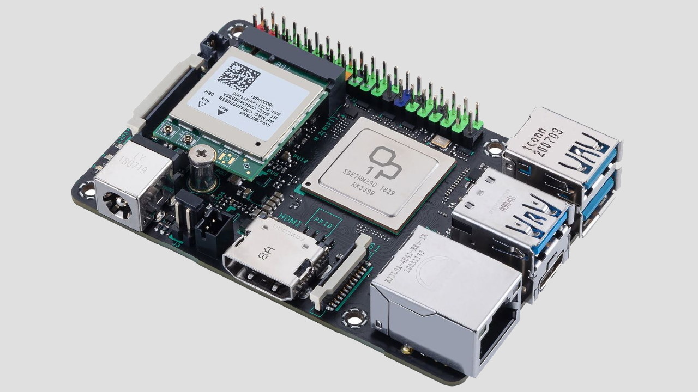
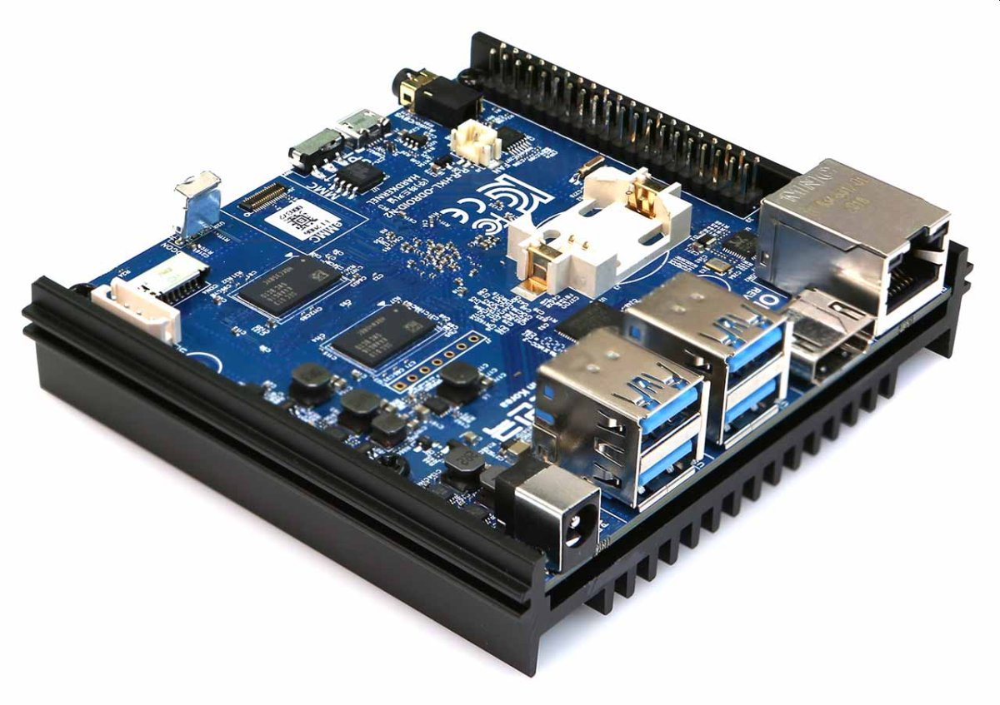

# Max Dowdall - AS91900
***Conducting a Critical Inquiry to Propose an Electronics Outcome***

## 1. Project Focus
### Problem Brainstorming:
- Remembering and creating secure passwords
- Losing items
- Phones being boring and social media mindless

## 2. Inquiry Questions
- What are common games people emulate? What controls will my device need? How powerful will it need to be?
- What connections/ports will I need to add to make this viable for anyone to use and charge? Will it need modern connections like bluetooth, USB-C, etc?
- How will the device last a day of use? What size battery will it need? Will it need a power-saving mode?
- How will the device be durable enough for every day use? What materials will it be made of? Will it need waterproofing?
- How will it be comfortable to use? How should the buttons be layed out? What should the screen be like to avoid eye-strain.

## 3. Milestones
|Target|Date|
|-|-|
|Research parts||
|Install and setup Retropie||
|Test games||
|Design the Schematic||
|Test on a breadboard||
|Design the PCB||
|Manufacture PCB||
|Program power control||
|Modify case to allow the PCB to fit well||
|Assemble case||
|Test games and all inputs||
|Test battery life and charging||
|Revise and adjust||

## 4. Research
The world of handheld devices has now been completely dominated by the smartphone, there are modern devices designed for playing games such as the Nintendo Switch, but this is far too large and pricey for what I want to create. 

Looking back to the early 2000s there are some great examples of pocket handhelds such as:

|||
|-|-|
|Nintendo Gameboy Advance||
|Sega Game Gear||
|Nintendo DS||

And many others. The one that stands out to me the most is the Nintendo Gameboy Advance SP.

It features a compact pocket design, which then unfolds into a comfortable handheld device. This clamshell design doubles to protect the screen and buttons.

## 5. Research Analysis  
### The Brain
For the brain of the computer I will need a small singleboard computer as designing an entire motherboard is out of the scope of this project. There are many available options such as:

|Name|Picture|Pros|Cons|
|-|-|-|-|
|Orange Pi 5 Plus||<ul><li>Designed for GNU/Linux</li><li>2.4GHz 8-core CPU with 16GB ram (Very fast)</li><li>Built in USB-C, HDMI, Power Button, WiFi, Bluetooth, microphone, headphone jack, and speaker connector</li></ul>|<ul><li>Expensive</li><li>Too large to embed</li><li>Will need cooling</li></ul>|[//]: ----------
|Asus Tinker Board S R2.0||a|a| [//]:----------
|Odroid N2||a|a|[//]: ----------
|Raspberry Pi 4||a|a| [//]:----------
|Pi Zero||<ul><li>Designed for GNU/Linux</li><li>Super cheap</li><li>Very small</li></ul>|<ul><li>Single core 1GHz CPU with 512MB ram (too slow for a comfortable emulating experience)</li></ul>| [//]:----------
|Pi Zero 2 W||<ul><li>Designed for GNU/Linux</li><li>Very cheap (slightly more expensive than the Pi Zero)</li><li>Very small (Same size as the Pi Zero)</li></ul>|<ul><li>Lack of inbuilt ports</li></ul>| [//]:----------
|Arduino Pro Portena X8||a|a| [//]:----------

### The Power Supply
I researched some mobile power options for the Pi Zero:

|Name|Picture|Pros|Cons|
|-|-|-|-|
|Juicebox Zero||<ul><li>Easy to use</li><li>All required features built in</li></ul>|<ul><li>Expensive</li><li>Not as compact as other options</li><li>Fixed shape for all parts, so customisation is limited</li></ul>|[//]:----------
|Pisugar 3||<ul><li>Easy to use</li><li>All required features, plus some fun and useful other ones</li></ul>|<ul><li>Very expensive</li><li>Tall form factor which wont fit well</li></ul>|[//]:----------
|PowerBoost 1000C||<ul><li>Low cost</li><li>Compact</li><li>Customisable form factor which will make it easy to fit</li></ul>|<ul><li>Will require an external circuit</li></ul>|

## 6. Perspectives
To gain better and more diverse perspectives I decided to ask some of my friends and family:
### Me:
#### Games:
- Turn based adventurers like 'Pokemon' and 'Final Fantasy Tactics Advance'
- Platformers fighters like 'Kirby & the Amazing Mirror' and 'Castlevania: Aria of Sorrow'
- Adventure games like 'The Legend of Zelda: The Minish Cap'
- Roguelikes like 'Brogue'

#### Form
- Able to be taken everywhere
- Pocket sized
- Used often, requires long battery life

### Holly:
#### Games:
- Turn based adventurers like 'Pokemon'
- Farming games like 'Harvest Moon'
- Platformers like 'Kirby & the Amazing Mirror'

#### Form:
- Able to be taken everywhere
- Pocket or bag size
- Used often, requires long battery life

### Jack:
#### Games:
- Turn based adventurers like 'Pokemon'
- Fighting games like 'Street Fighter'

#### Form:
- Able to be taken everywhere
- Pocket sized
- Used often, requires long battery life

### Evaluation
According to my findings: 
- All users would prefer the device to be handheld.
- All users would prefer the device to have a long battery life.
- Users want to play a mix of slow pace/turn based games and fast paced action games.

This means the device must be:
- Compact enough to fit in a pocket
- Comfortable to hold long periods of time
- Large buttons suited for fast pace action
- Large battery for long run time

The challenge will be creating a design that balances these variables well. Too small and it will have a poor battery life and be uncomfortable to use. Too large and it will not be able to fit in your pocket. 

## 7. Critiquing

## 8. Refined Project Focus

## 9. Future Opportunities
This project, being a recreation of a retro handheld has the opportunity to easily be reshaped into various other handhelds of the time. The Pi Zero is more than capable of running various emulators, it is simply a matter of rearranging the circuit to fit the new form factor.

I would be able to recreate various handheld consoles using the same, or slightly modified circuit. Some popular ones I could recreate are:
- Gameboy/Gameboy Color
- Gameboy Advance
- Sega Game Gear
- Nintendo DS/Nintendo 2DS
- PlayStation Portable

There is also great opportunity to create my own design for handheld consoles in the style of at home consoles. These could be custom modelled and printed to keep elements of the design of the original console, all while compacting it into a handheld experience. Some popular ones of could create are:
- Atari 7800
- NES/SNES
- Commodore 64
- Sega Genesis/Sega Saturn
- Nintendo 64
- Sega Dreamcast
- PlayStation/PlayStation 2
- GameCube

## 10. Proposed Solution
As a kid, I had a great experience playing on my Nintendo 3DS, which unfortunately I no longer have. I want to create a handheld in a similar style to appeal to mine, and others' childhood nostalgia. I have always loved the design and formfactor of the Nintendo Gameboy Advance SP. It features a compact pocket design, which then unfolds into a comfortable handheld device. This clamshell design doubles to protect the screen and buttons. The brains behind the device will be a Raspberry Pi Zero 2 W.

This device is a tiny and low cost 64-bit single board computer, designed to run GNU/Linux, which is my preferred operating system, this one runs a specific distro called Raspian (I refuse to use the rebranded name Raspberry Pi OS). It boasts an impressive quad-core 1GHz CPU and 512MB of SDRAM. That’s otherworldly from the original Nintendo GBA SP’s single core 16MHz and 384Kb of total ram. This will allow a smooth and fast experience playing retro handheld games, as well as any application I implement. It also supports comes with Bluetooth 4.2 and 2.4GHz Wireless LAN, which will allow easy connection to the device, such as connecting Bluetooth headphones, wirelessly transferring games, automated updates, etc.

### Proposed Diagram
|Inside|Top|
|-|-|
|||

## 11. Risks and Mitigations

## 12. Evaluation

## 13. Learnings and Reflections