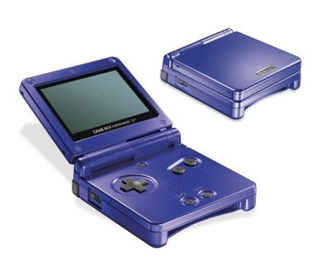

# Max Dowdall - AS91900
***Conducting a Critical Inquiry to Propose an Electronics Outcome***

## Project Focus
### Problem Brainstorming:
- Remembering and creating secure passwords
- Losing items
- Phones being boring and social media mindless

## Inquiry Questions
- What are common games people emulate? What controls will my device need? How powerful will it need to be?
- What connections/ports will I need to add to make this viable for anyone to use and charge? Will it need modern connections like bluetooth, USB-C, etc?
- How will the device last a day of use? What size battery will it need? Will it need a power-saving mode?
- How will the device be durable enough for every day use? What materials will it be made of? Will it need waterproofing?
- How will it be comfortable to use? How should the buttons be layed out? What should the screen be like to avoid eye-strain.

## Milestones
|Target|Date|
|-|-|
|Design the PCB||

## Research
The world of handheld devices has now been completely dominated by the smartphone, there are modern devices designed for playing games such as the Nintendo Switch, but this is far too large and pricey for what I want to create. 

Looking back to the early 2000s there are some great examples of pocket handhelds such as the Nintendo Gameboy Advance, the Sega Game Gear, the Nintendo DS, the Playstation Portable and many others. The one that stands out to me the most is the Nintendo Gameboy Advance SP.

