# Max Dowdall - AS91900
***Conducting a Critical Inquiry to Propose an Electronics Outcome***

## 1. Project Focus
### Problem Brainstorming:
1. Remembering and creating secure passwords.
2. Losing items.
3. Social media being a mindless attention grabber.
4. Modern phones all being owned by large data collecting corporations.
5. Modern phones all being the same glass rectangle, there is no individuality.

### Problem Summary
For my project problem I have decided to focus on a combination of 3, 4, and 5. I will expand on each of the points. 
#### Social Media
Modern social media is designed with the sole intent of keeping you scrolling for as long as possible to gather information about you. I, as well as so many others find it far too easy to pickup their phone and just start scrolling. Social media becomes draining and there is no sense of achivement. 

My solution comes from when I discovered the wonderful world of game emulation. When I had some down time and wanted something relaxing to do, whether that be on the bus, in bed, etc, instead of scrolling and achieving nothing, I felt joy from winning a Pokémon battle or finally beating that boss in Castlevania.

Phones work for some games, mostly turn based, but trying to play fast paced games is an absolute nightmare. Creating a device with physical buttons designed for emulation would result in a far superior experience.

#### Data Collecting Corporations
All modern smartphones are software locked down and proprietary, this means you do not have full control over the device and are unable to see what the phone is doing without you knowing. This creates major privacy issues where the company owning your phone is able to do whatever they please with your information. Yes there are legal restrictions, but often these are not enough. It also creates issues where you are unable to do anything if they randomly stop supporting some piece of software, you are at their whim.

My device will run on purely open-source software, these means you have full control over the device and are able to see whatever it may be doing. It creates a much healthier user to software relationship, respecting you as a consumer.

#### Lack Of Individuality
Modern smartphone have very much converged to a standard design, a thin glass brick. While this definitly helps with industry standardisation, it removes all individuality. I much personally prefer the innovative and charming phones of the early 2000s, just look at some of these:
|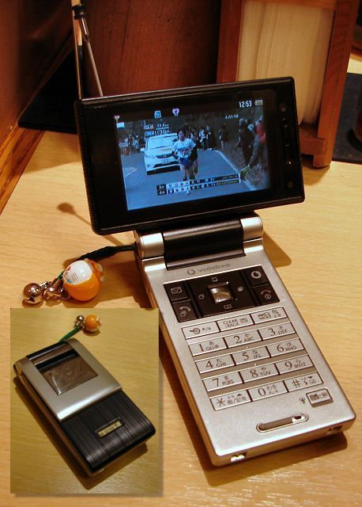|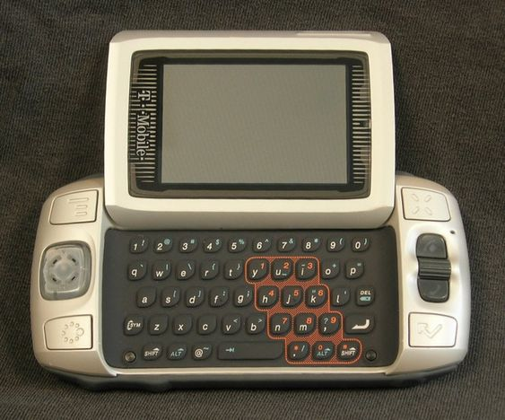|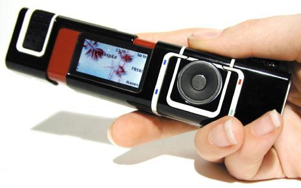|
|-|-|-|
|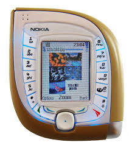|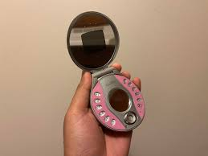||a|'

We've lost all mechanicalness and fun shape and design from phones, I find this very boring. I would like to make something with a mechanical feature and a fun shape and design.

#### Summary
To summarise I am creating a pocket sized portable device to counter the mindlessness, boring standardisation and privacy concerns of modern phones.

## 2. Inquiry Questions
- What are common games people emulate? What controls will my device need? How powerful will it need to be?
- What connections/ports will I need to add to make this viable for anyone to use and charge? Will it need modern connections like bluetooth, USB-C, etc?
- How will the device last a day of use? What size battery will it need? Will it need a power-saving mode?
- How will the device be durable enough for every day use? What materials will it be made of? Will it need waterproofing?
- How will it be comfortable to use? How should the buttons be layed out? What should the screen be like to avoid eye-strain.

## 3. Milestones
The project can start when I have received the parts which should be around the start of September, and it must be completed by the due date 27 September. This gives me ~25 days to complete the physical parts of the project. As I have to wait until the parts arrive, all programming and design should be completed first. 
|Target|Date|
|-|-|
|Design the Schematic|27 August|
|Design the PCB|29 August|
|Programming for the power logic|1st September|
|Install and setup Retropie|5th September|
|Test games|5th September|
|Test on a breadboard|7th September|
|Manufacture PCB|15th September|
|Modify case to allow the PCB to fit well|17th September|
|Solder together parts|19th September|
|Assemble case|20th September|
|Test games and all inputs|21st September|
|Test battery life and charging|22nd September|
|Revise and adjust|25th September|

This gives me 2 days space in case anything required more time.

## 4. Research
### Form
The world of handheld devices has now been completely dominated by the smartphone, there are modern devices designed for playing games such as the Nintendo Switch, but this is far too large and pricey for what I want to create. 

Looking back to the early 2000s there are some great examples of pocket handhelds such as:

|Name|Picture|Features|Issues|
|-|-|-|-|
|Nintendo Gameboy Advance|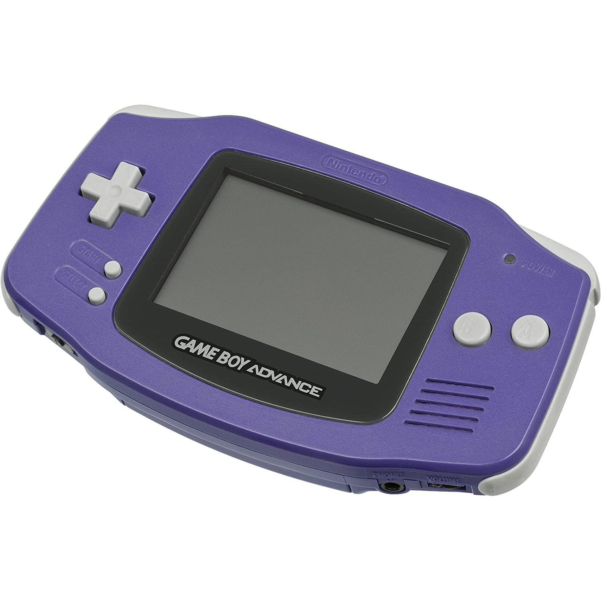|<ul><li></li></ul>|
|Sega Game Gear||
|Nintendo DS|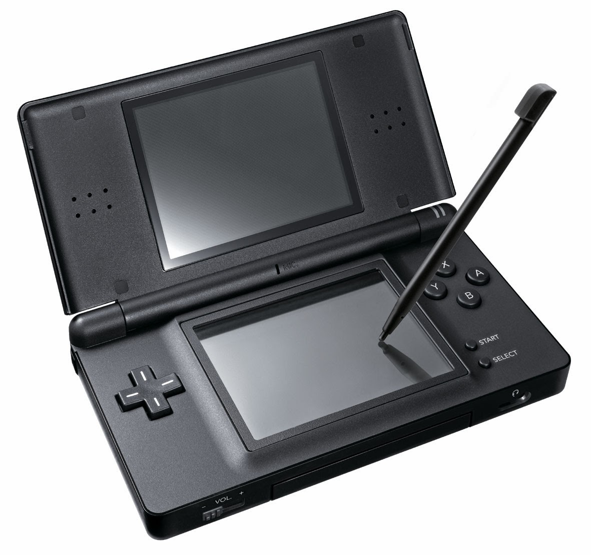|

And many others. The one that stands out to me the most is the Nintendo Gameboy Advance SP.

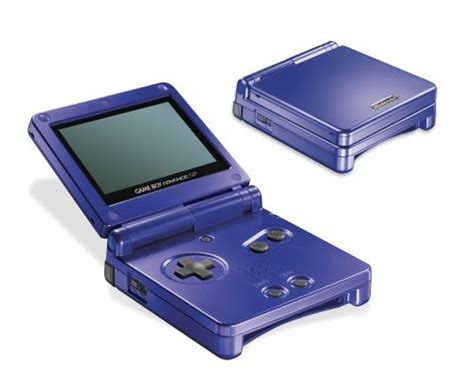

It features a compact pocket design, which then unfolds into a comfortable handheld device. This clamshell design doubles to protect the screen and buttons which is great for throwing in a bag, or chucking in your pocket.

### Parts
#### The Brain
For this project a small form factor single board computer is the most viable option, I looked at a variety of boards and picked some viable options for later comparison:
- Orange Pi 5 Plus
- Raspberry Pi 4 Model B	
- Pi Zero	
- Pi Zero 2 W	
- Arduino Pro Portena X8

#### The Power Supply
As I want this project to be portable and rechargeable it will require its own power supply. After some research I found 3 viable options for later comparison:
- Juicebox Zero
- Pisugar 3
- PowerBoost 500c/1000c

## 5. Research Analysis  
### The Brain
For the brain of the computer I will need a small singleboard computer as designing an entire motherboard is out of the scope of this project. There are many available options such as:

|Name|Picture|Pros|Cons|
|-|-|-|-|
|Orange Pi 5 Plus|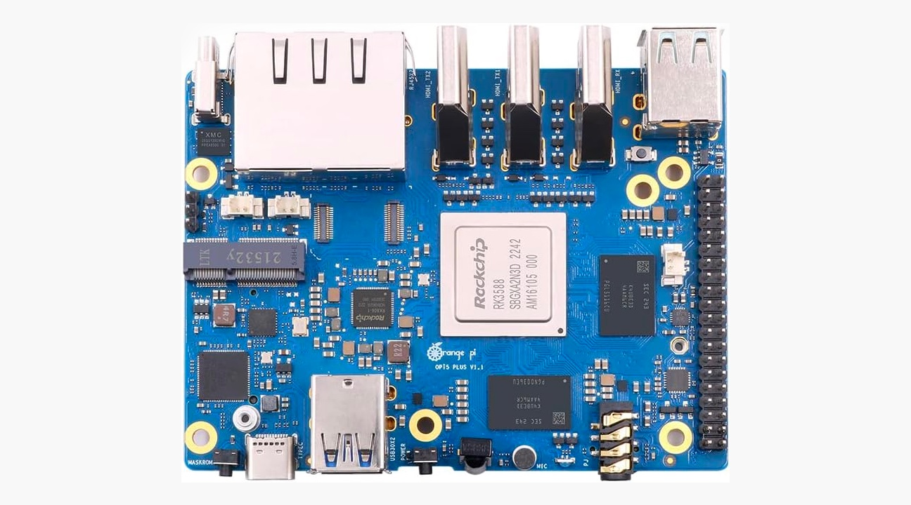|<ul><li>Designed for GNU/Linux</li><li>2.4GHz 8-core CPU with 16GB ram (Very fast)</li><li>Built in USB-C, HDMI, Power Button, WiFi, Bluetooth, microphone, headphone jack, and speaker connector</li></ul>|<ul><li>Expensive</li><li>Too large to embed</li><li>Will need cooling</li></ul>|[//]: ----------
|Raspberry Pi 4 Model B|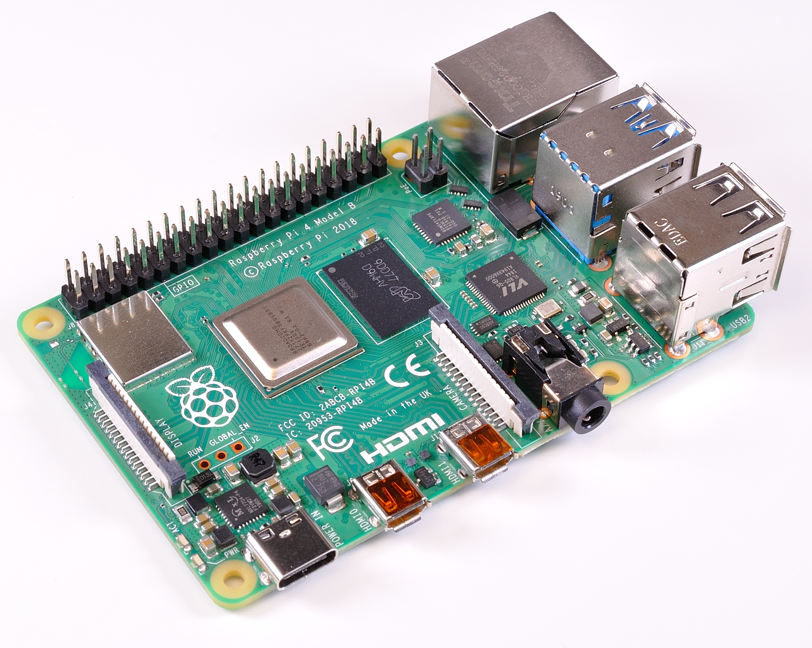|<ul><li>Designed for GNU/Linux</li><li>1.8GHz Quad-core CPU (Fast)</li><li>Multiple choices for amount of RAM 1-8GB</li><li>Built in USB-C, HDMI, USB2$\times$2, USB3$\times$2, Gigabit ethernet, 5GHz Wi-Fi, Bluetooth 5.0</li></ul>|<ul><li>Moderately expensive</li><li>Too large to embed</li></ul>| [//]:----------
|Pi Zero|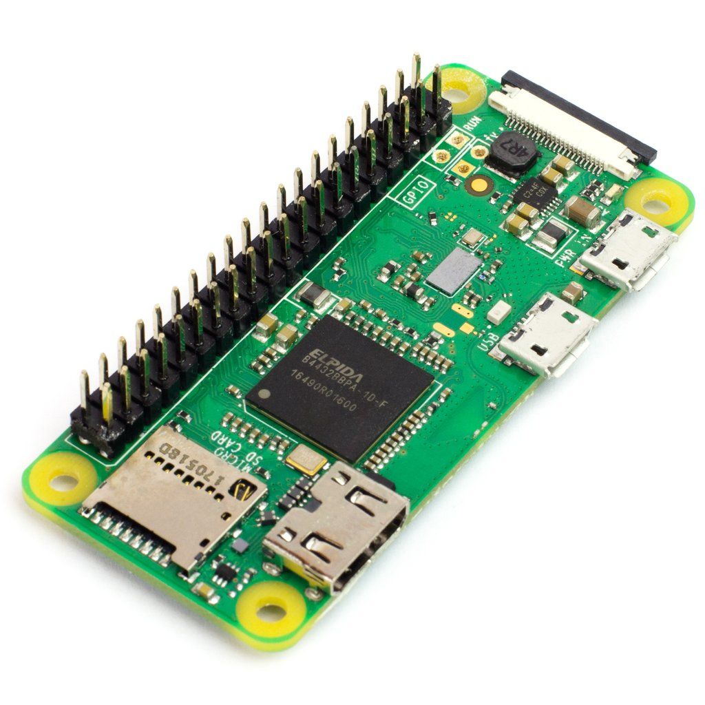|<ul><li>Designed for GNU/Linux</li><li>Super cheap</li><li>Very small</li></ul>|<ul><li>Single core 1GHz CPU with 512MB ram (too slow for a comfortable emulating experience)</li><li>Lack of inbuilt ports and wireless connection</li></ul>| [//]:----------
|Pi Zero 2 W|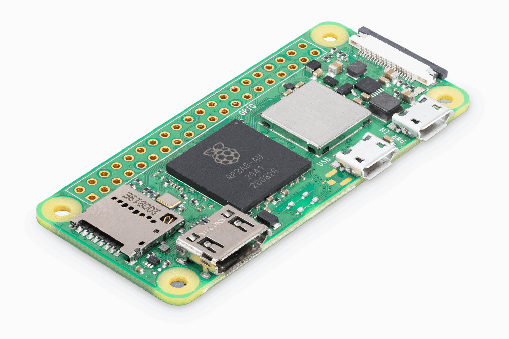|<ul><li>Designed for GNU/Linux</li><li>Very cheap (slightly more expensive than the Pi Zero)</li><li>Very small (Same size as the Pi Zero)</li><li>Inbuilt 2.4GHz Wi-FI, Bluetooth 4.2</li></ul>|<ul><li>Lack of inbuilt ports</li></ul>| [//]:----------
|Arduino Pro Portena X8|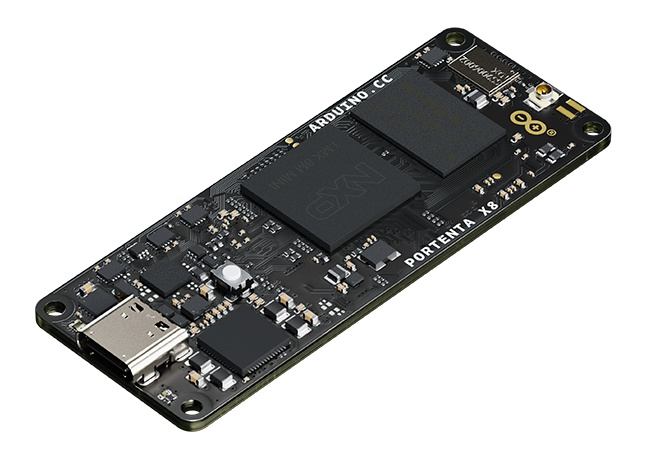|<ul><li>Designed for GNU/Linux</li><li>9 cores: 4$\times$1.8GHz + Others around 500-400MHz (Fast)</li><li>Very small (Same size as the Pi Zero)</li></ul>|<ul><li>Lack of inbuilt ports</li><li>Very expensive</li></ul>| [//]:----------

I decided to go with the Pi Zero 2 W, as in my opinion it has the best tradeoff between size, performance, cost, adaptability, and functionality.
### The Power Supply
I researched some mobile power options for the Pi Zero:

|Name|Picture|Pros|Cons|
|-|-|-|-|
|Juicebox Zero|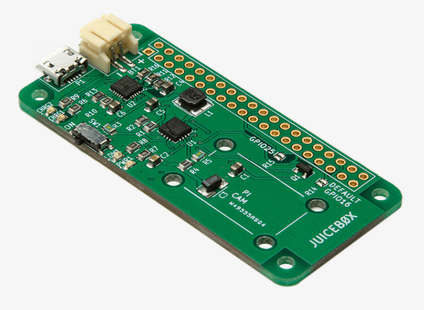|<ul><li>Easy to use</li><li>All required features built in</li></ul>|<ul><li>Expensive</li><li>Not as compact as other options</li><li>Fixed shape for all parts, so customisation is limited</li></ul>|[//]:----------
|Pisugar 3|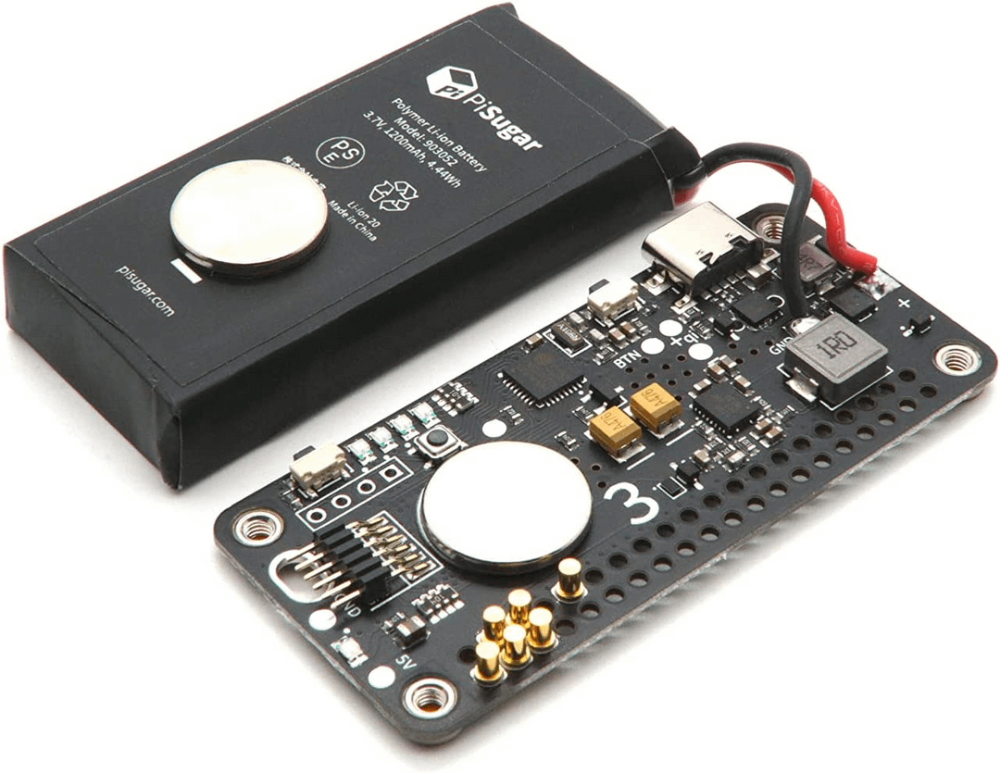|<ul><li>Easy to use</li><li>All required features, plus some fun and useful other ones</li></ul>|<ul><li>Very expensive</li><li>Tall form factor which wont fit well</li></ul>|[//]:----------
|PowerBoost 500C|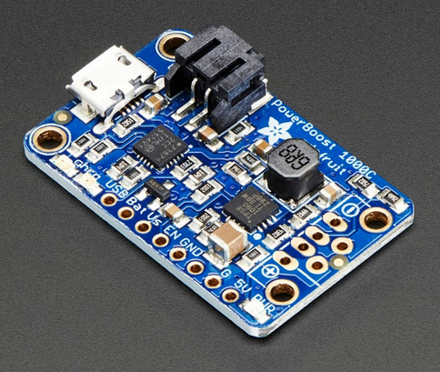|<ul><li>Low cost</li><li>Compact</li><li>Customisable form factor which will make it easy to fit</li></ul>|<ul><li>Will require an external circuit</li></ul>|
|PowerBoost 1000C||<ul><li>Low cost</li><li>Compact</li><li>Customisable form factor which will make it easy to fit</li></ul>|<ul><li>Will require an external circuit</li></ul>|

I decided to go with the PowerBoost 1000C as I believe it has the best tradeoff between cost, size, and functionality.

## 6. Perspectives
To gain better and more diverse perspectives I decided to ask some of my friends to see how they would want to use such a device:
### Me:
#### Games:
- Turn based adventurers like 'Pokémon' and 'Final Fantasy Tactics Advance'
- Platformers fighters like 'Kirby & the Amazing Mirror' and 'Castlevania: Aria of Sorrow'
- Adventure games like 'The Legend of Zelda: The Minish Cap'
- Roguelikes like 'Brogue'

|Castlevania|Final Fantasy Tactics Advance|
|-|-|
|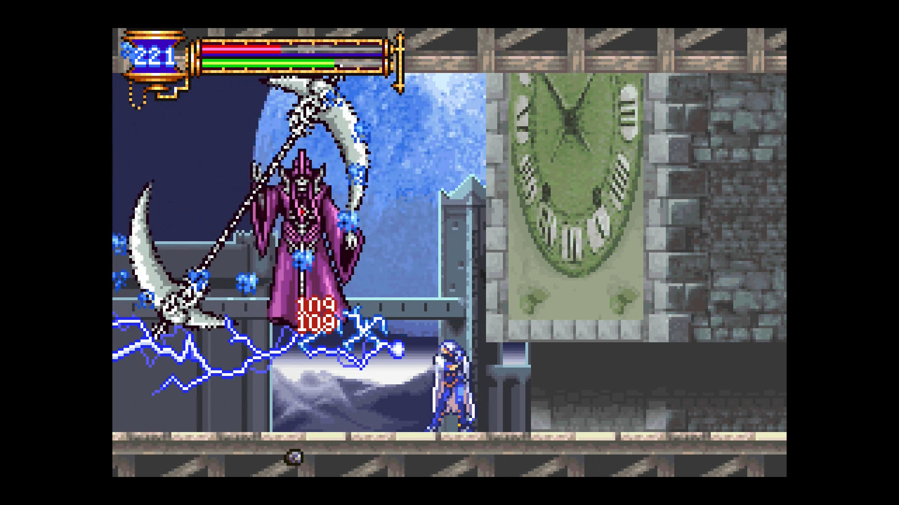|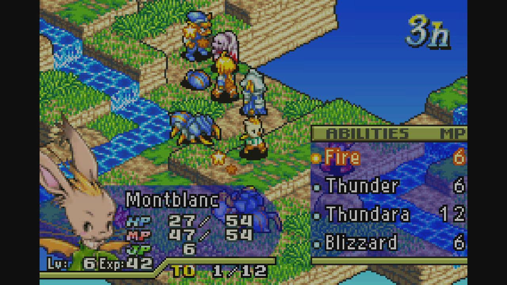|

#### Form
- Able to be taken everywhere
- Used at home, or while waiting on busses, meetings, etc.
- Pocket sized
- Used often, requires long battery life

### Holly:
#### Games:
- Turn based adventurers like 'Pokémon'
- Farming games like 'Harvest Moon'
- Platformers like 'Kirby & the Amazing Mirror'

|Harvest Moon|Kirby & the Amazing Mirror|
|-|-|
|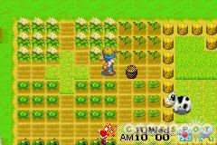||

#### Form:
- Able to be taken everywhere
- Used at home, or while waiting on busses, meetings, etc.
- Pocket or bag size
- Used often, requires long battery life

#### Requests:
- Wants to be able to transfer games wirelessly.


### Jack:
#### Games:
- Turn based adventurers like 'Pokémon'
- Fighting games like 'Street Fighter'
- Platformer fighters like "Plok!"

|Street Fighter|Pokémon Emerald|
|-|-|
|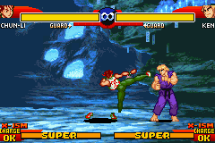|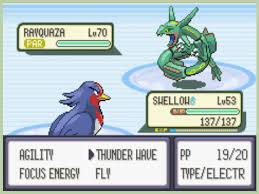|

#### Form:
- Able to be taken everywhere
- Pocket sized
- Used often, requires long battery life

### Requests:
- Wants to be able to link saves with desktop computer.

### Evaluation
According to my findings: 
- All users would prefer the device to be handheld.
- All users would prefer the device to have a long battery life.
- Users want to play a mix of slow pace/turn based games and fast paced action games.

This means the device must be:
- Compact enough to fit in a pocket
- Comfortable to hold long periods of time
- Large buttons suited for fast pace action
- Large battery for long run time

The challenge will be creating a design that balances these variables well. Too small and it will have a poor battery life and be uncomfortable to use. Too large and it will not be able to fit in your pocket. 

## 7. Critiquing
All my research has been taken from the data sheets from the manufacturer of the product so it is reliable. I have based my opinions off the data, this way my choice will not be swerved by a random person's personal preference.

Though, just a data sheet isn't enough to show whether a product is viable. To provide more info in the real usage of the product, user reviews would be good. I originally stayed away from this, but as long as I fact check the info and compare for and against views, user reviews can be a useful info source.

## 8. Refined Project Focus
### Requirements After Evaluation
After careful consideration to how and where this device will be used I have listed some other issues to be solved in the design:

#### Fast saving and suspending
Often where this device will be used will be places of waiting where you have to suddenly stop playing, this will leave you with no time to save your game and shutdown the device. To solve this I will encorporate a lid switch by using a magnet and hall-effect sensor, when the lid is detected as closed the device will:
1. Pause the emulation.
2. Create a save state in case of power loss.
3. Power off the display.
4. Put the Pi Zero into a suspend state.

This will ensure your game progress is safe no matter how suddenly you have to stop, and that power is conserved when not in use.

The device will also optionally shutdown after a period of time to conserve more power. Tests on battery life in suspended state will be conducted to decide good time periods for this.

When the lid is opened back up, the device will:
1. Bring the Pi Zero out of its suspend state.
2. Power on the display.
3. Resume the emulation.

This will make stopping and starting a seamless process, and great for playing when hopping between busses, between work and meetings, etc.

#### Wireless file transfer and syncing
2 requests I had were the abilities to transfer files wirelessly, so they don't have to bother with cables or SD cards, and being able to sync games with a computer wirelessly. These 2 features can be implemented using the same technology as they are both simply transferring files. 

For the file transfer I will use [SFTP](https://www.ssh.com/academy/ssh/sftp-ssh-file-transfer-protocol), a secure file transfer protocol which is I am very familiar with. To interface with the device the user can connect to its IP in a web browser on their phone or computer, and transfer and manage files with a web user interface.

For syncing I will use a combination of SFTP and the version control software [Git](https://git-scm.com/). This will allow me to check for the most up to date save file(s), and ensure that both devices have that save. This will be handled by a simple script like the following:

Computer (client side) script:
```bash
#!/bin/bash

# bash script called when emulating on client

# 0 = found by grep
# 1 = not found by grep

while true; do
    # Checks if local files are
    # up to date with the server
    git status | grep "is up to date"
    up_to_date=$?

    # If not up to date then update
    if [ up_to_date -eq 1 ]; then
        git pull
    fi

    # Checks if there have been changes
    # to the local save file
    git status | grep "Untracked files"
    commit=$?

    # If this device is ahead, then
    # commit and push changes to
    # update the server
    if [ commit -eq 0 ]; then
        git add --all
        git commit
        git push
    fi

    sleep 10
done
```
Pi Zero (Server side) script:
```bash
#!/bin/bash

# bash script called when emulating on server

# 0 = found by grep
# 1 = not found by grep

while true; do
    # Checks if there have been changes
    # to the local save file
    git status | grep "Untracked files"
    commit=$?

    # If this device is ahead, then
    # commit and update the repository
    if [ commit -eq 0 ]; then
        git add --all
        git commit
    fi

    sleep 10
done
```
(I will also implement a client side script for Windows users using Python, as they don't have a built in language as capable as Bash.)

These 2 scripts will ensure that both devices are always in sync, this removes the issues of having out of sync save files between devices.

Using version control like this, ensures security of your save files. Too many times have I lost my progress, now this is impossible with Git tracking each save. It also allows you to rollback to a previous save file, this is essential in repairing corrupt saves.

### Final Project Focus
My project aim's to solve the issues created by social media and large data collecting corporations. I aim to fix this by creating a device which creates an alternative to mindlessly scrolling social media, by allowing you to play GBA style games when you need to zone out, which creates far more fulfilling down time. The device will also respect you and your privacy by being completely open-source, and collecting no information.

After lots of research and evaluation I have decided what the device will require:

The device will be used both at home in the comfort of a bed or couch, and out in public when on a bus, waiting for a meeting, etc. It will need to be compact enough to fit in a pocket, yet large enough to be comfortable to hold and use, and have a long enough battery life. It will require automatic saving and good power management to make it easy and convenient to use. It will need to be comfortable to play both turn based and action games. It will require wireless connections, including Bluetooth and WiFi, for file transfer and connecting headphones. It will need USB-C for charging and data-transfer to be compatible with the modern standard, USB-A for other modern data transfer or peripherals. User friendly interfaces for all aspects, including changing settings, updating, connecting Bluetooth periferals, and transferring files over WiFi and Bluetooth.

## 9. Future Opportunities
This project, being a recreation of a retro handheld has the opportunity to easily be reshaped into various other handhelds of the time. The Pi Zero is more than capable of running various emulators, it is simply a matter of rearranging the circuit to fit the new form factor.

I would be able to recreate various handheld consoles using the same, or slightly modified circuit. Some popular ones I could recreate are:
- Gameboy/Gameboy Color
- Gameboy Advance
- Sega Game Gear
- Nintendo DS/Nintendo 2DS
- PlayStation Portable

There is also great opportunity to create my own design for handheld consoles in the style of at home consoles. These could be custom modelled and printed to keep elements of the design of the original console, all while compacting it into a handheld experience. Some popular ones of could create are:
- Atari 7800
- NES/SNES
- Commodore 64
- Sega Genesis/Sega Saturn
- Nintendo 64
- Sega Dreamcast
- PlayStation/PlayStation 2
- GameCube

## 10. Proposed Solution
I have decided to call this device Nostalpi SP, derived from the words 'Nostalgia', 'Rasberry Pi', 'GBA SP'

A little logo, courtesy of my girlfriend
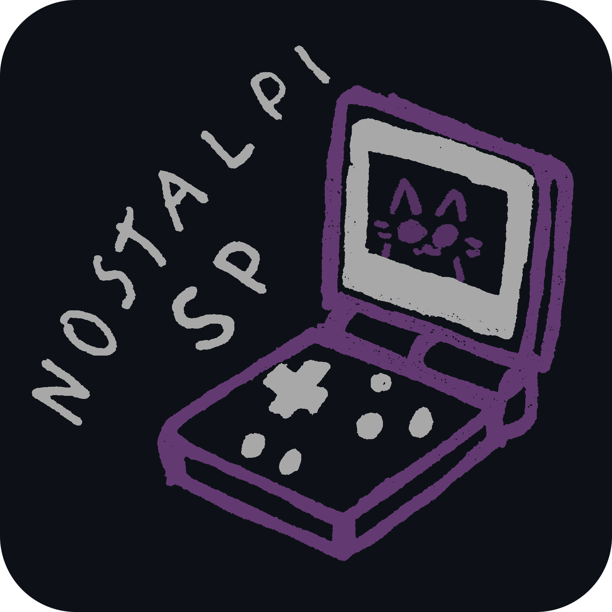

As a kid, I had a great experience playing on my Nintendo 3DS, which unfortunately I no longer have. I want to create a handheld in a similar style to appeal to mine, and others' childhood nostalgia. I have always loved the design and formfactor of the Nintendo Gameboy Advance SP. It features a compact pocket design, which then unfolds into a comfortable handheld device. This clamshell design doubles to protect the screen and buttons. The brains behind the device will be a Raspberry Pi Zero 2 W.

The Raspberry Pi Zero is a tiny and low cost 64-bit single board computer, designed to run GNU/Linux, which is my preferred operating system, this one runs a specific distro called Raspian (I refuse to use the rebranded name Raspberry Pi OS). It boasts an impressive quad-core 1GHz CPU and 512MB of SDRAM. That’s otherworldly from the original Nintendo GBA SP’s single core 16MHz and 384Kb of total ram. This will allow a smooth and fast experience playing retro handheld games, as well as any application I implement. It also supports comes with Bluetooth 4.2 and 2.4GHz Wireless LAN, which will allow easy connection to the device, such as connecting Bluetooth headphones, wirelessly transferring games, automated updates, etc.

Nostalpi SP is a pocket sized gaming handheld 

### Proposed Diagram
 

Further decoration and polishing will be added to the case to create a refined outcome.

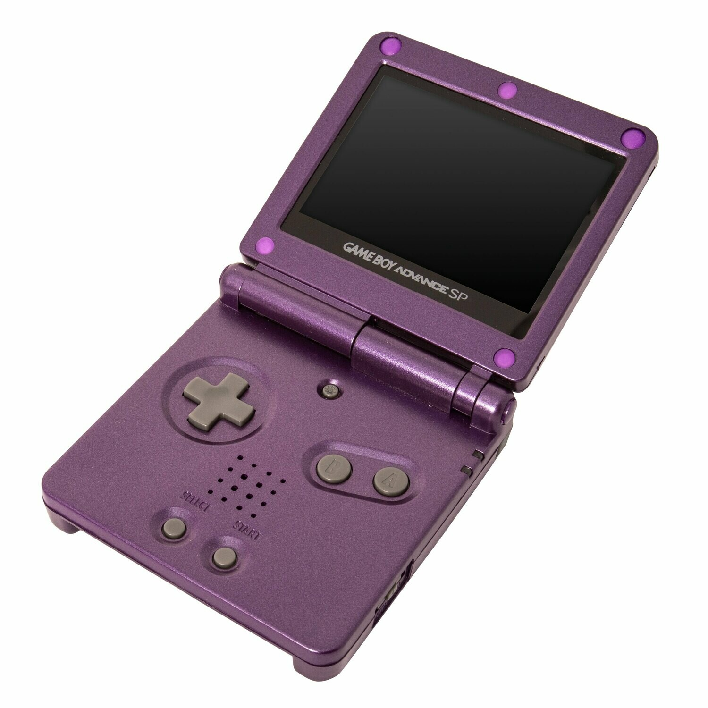

## 11. Risks and Mitigations
### Risks
Some risks that may be apparent in implementing the proposed solution include:
- Battery shorts/other issues if the charging circuit has an issue.
- General shorts by parts touching one another.
- Case being too fragile due to removed materials.

### Mitigation
Some ways theses risks can be mitigated are:
- Thoroughly testing the charging circuit with a multimeter, to ensure it works as it should, before connecting a battery.
- Thoroughly testing the PCB and other components' connections with a multimeter to ensure they work as they should, before final assembly.
- Adequate spacing and/or insulation between layers to prevent shorts.
- Carefully removing as little material as possible to fit the parts, and if an area is too thin add reinforcement. The large amount of material will be removed using a rotary tool for the sake of speed, and the final parts will be removed using abrasive paper to ensure a precise fit. Material can be added by gluing small bits of plastic or metal.

## 12. Evaluation


## 13. Learnings and Reflections